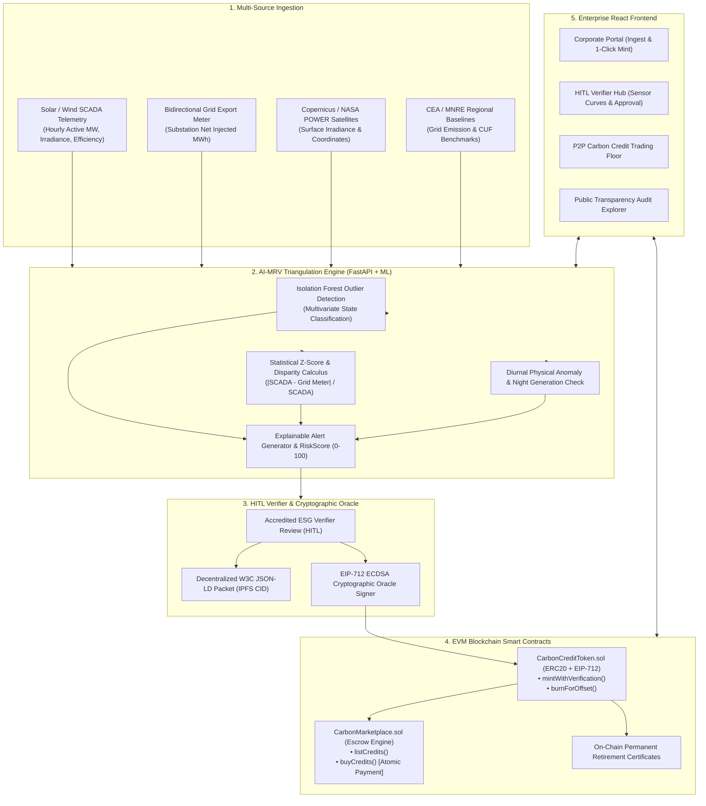

# ZeroTrace — Enterprise Blockchain Carbon Credit & AI-MRV Platform

[](https://soliditylang.org/)
[](https://hardhat.org/)
[](https://fastapi.tiangolo.com/)
[](https://scikit-learn.org/)
[](https://react.dev/)
[](https://tailwindcss.com/)

**ZeroTrace** is a production-grade, secure, full-stack enterprise dApp platform for corporate carbon credit minting, peer-to-peer trading, and permanent offset retirement backed by autonomous **AI-MRV (Monitoring, Reporting, and Verification)**.

---

## 🏛 System Architecture



---

## 📦 Core Modules

### 1. Smart Contract Architecture (Solidity & Hardhat)
- **`CarbonCreditToken.sol`**:
  - OpenZeppelin standard ERC20 with customized metadata extensions (`projectId`, `vintageYear`, `location`, `methodologyHash`).
  - `mintWithVerification(address corporate, uint256 amount, bytes32 claimDigest, bytes signature)`: Validates that the signature was signed by the authorized platform Oracle / HITL verifier using EIP-712 typed data hashing and ECDSA recovery.
  - **Replay Attack Prevention**: Maintained via `mapping(bytes32 => bool) public executedClaims`.
  - **Zero-Cost Minting**: Corporate pays only execution gas.
  - `burnForOffset(uint256 amount, string corporateBeneficiary, string reason)`: Permanently burns tokens, calculates a unique `certificateId` hash, and emits `event CarbonRetired(...)`.
- **`CarbonMarketplace.sol`**:
  - Secure peer-to-peer listing and atomic buying of credits (`listCredits`, `cancelListing`, `buyCredits`).
  - Uses OpenZeppelin `ReentrancyGuard` and `SafeERC20` to prevent reentrancy and token transfer edge-cases.

### 2. AI-MRV Ingestion & Verification Engine (FastAPI + ML)
- **Multi-Source Ingestion API**: Hourly SCADA telemetry, bidirectional grid export meters, CEA/MNRE baseline datasets, and Copernicus satellite irradiance.
- **AI Anomaly Detection**: `scikit-learn` Isolation Forest and Z-score models detecting cross-source disparity, phantom night generation, sensor miscalibration, and regional capacity utilization factor (CUF) violations.
- **RiskScore (0–100) & Explainable Alerts**: Computed with conservative validated generation limits.
- **HITL Verifier Workflow & Cryptographic Oracle**: Reviews pending claims, pins W3C JSON-LD reports to IPFS, and generates EIP-712 ECDSA authorization signatures with the verifier private key.

### 3. Persistence & Relational Schema (SQLAlchemy)
- `users`: Corporate entities, verifiers, and governance administrators.
- `projects`: Renewable generation assets (Bhadla Solar, Kutch Wind, Pavagada Solar).
- `telemetry_batches`: Ingested multi-source sensor frames and ingestion hashes.
- `claims`: Telemetry verification records, validated MWh, risk scores, IPFS CIDs, and Oracle signatures.
- `retirements`: Permanent on-chain carbon offset retirement certificates.
- `marketplace_listings`: Order book cache synchronized with on-chain escrow state.

### 4. Enterprise Frontend Dashboard (React + Tailwind CSS)
- **Corporate Portal**: Telemetry ingestion workspace, live pre-flight anomaly check, 1-Click zero-cost minting, and offset retirement hub.
- **HITL Verifier Hub**: Live triage queue, multi-sensor comparison charts (SCADA vs. Grid Export), explainable alerts breakdown, and 1-Click cryptographic signing.
- **Decentralized Carbon Marketplace**: Order book with filters (vintage, project type, price), escrow listings, and instant atomic purchasing.
- **Transparency Explorer**: Public audit registry with W3C JSON-LD viewer and downloadable retirement certificates.

---

## 🚀 Quickstart Guide

### Prerequisites
- **Node.js**: v18+ (tested on Node v20/v26)
- **Python**: 3.10+ (tested on Python 3.14)
- **Git**

### Single-Command Start
Run the unified launcher script:
```bash
./start.sh
```
This automatically:
1. Boots local Hardhat node on `http://127.0.0.1:8545`
2. Compiles and deploys `CarbonCreditToken` & `CarbonMarketplace` smart contracts
3. Launches FastAPI AI-MRV backend on `http://127.0.0.1:8000` (docs at `/docs`)
4. Starts Vite React frontend on `http://localhost:5173`

---

## 🧪 Running Tests

Execute the complete verification test suite:
```bash
./test.sh
```

### Running Individual Test Suites

#### 1. Smart Contract Hardhat Tests
```bash
cd contracts
npx hardhat test
```
**Coverage**:
- Valid & forged EIP-712 / ECDSA signature verification
- Replay attack prevention on `claimDigest`
- Marketplace escrow listing, partial & full atomic buying, overpayment refund, and cancellation
- Permanent burn balances and retirement certificate event logging

#### 2. Backend AI-MRV & Oracle Tests
```bash
cd backend
PYTHONPATH=. ./venv/bin/pytest -v tests
```
**Coverage**:
- Clean telemetry physical baseline evaluation
- Severe over-reporting and phantom night generation anomaly detection
- EIP-712 cryptographic signature generation and recoverability
- W3C JSON-LD serialization and IPFS multihash CID pinning
- Full API telemetry ingestion to HITL verifier approval flow

---

## 📡 API Reference Summary

| Method | Endpoint | Description |
|---|---|---|
| `GET` | `/api/mrv/stats` | Platform aggregate generation, credits, and retirements |
| `GET` | `/api/projects` | List registered renewable generation assets |
| `POST` | `/api/telemetry/ingest` | Ingest multi-source telemetry & run AI anomaly evaluation |
| `POST` | `/api/telemetry/upload-csv` | Direct CSV file upload for telemetry batches |
| `GET` | `/api/mrv/pending-claims` | Retrieve claims awaiting HITL verifier review |
| `POST` | `/api/mrv/approve-claim/{id}` | Verifier approval: pins to IPFS & issues EIP-712 signature |
| `POST` | `/api/mrv/reject-claim/{id}` | Verifier rejection with rationale |
| `POST` | `/api/mrv/confirm-mint/{id}` | Record on-chain execution transaction hash |
| `GET` | `/api/mrv/ipfs/{cid}` | Retrieve decentralized JSON-LD compliance document |
| `GET` | `/api/marketplace/listings` | Active marketplace order book |
| `GET` | `/api/retirements` | Query permanent carbon offset retirement certificates |

---

## 🔐 Security & Verification Guarantees

1. **Double-Spend & Replay Protection**: `mapping(bytes32 => bool) public executedClaims` guarantees each verified batch can only be minted once on-chain.
2. **Reentrancy Protection**: `ReentrancyGuard` on all state-modifying functions in the marketplace and token contracts.
3. **Multi-Source Triangulation**: Prevents over-crediting by benchmarking SCADA against independent bidirectional grid meters, Copernicus satellite irradiance, and CEA regional capacity utilization curves.
4. **Conservatively Validated Generation**: Credits are calculated using `min(SCADA_MWh, GridExport_MWh) * GridEmissionFactor`, subtracting any detected night or unphysical generation.

---

## 📄 License
MIT License. Built for enterprise sustainability & compliance standards.
